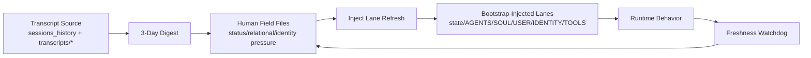
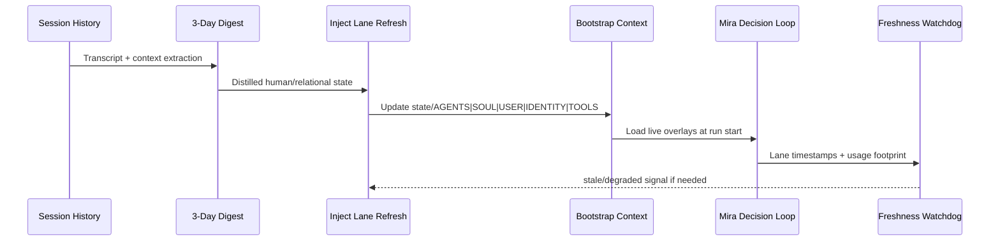
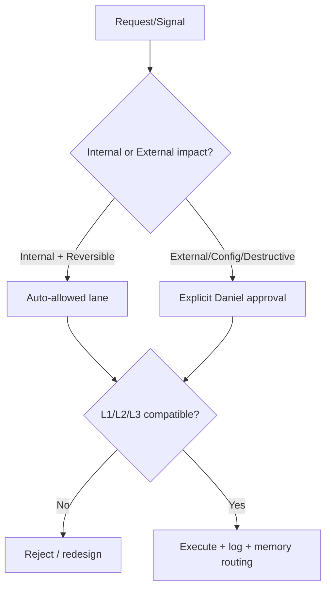

# Mira — komplexný dizajnový dokument projektu (architektonický pohľad)

**Verzia:** 2026-03-27  
**Autor pohľadu:** AI systems architect review (Mira)  
**Publikum:** technické aj netechnické (zrozumiteľné „ľudsky“, s technickou presnosťou)

---

## 1) Executive summary (stručne)

Projekt **Mira (Symbiotic Jarvis)** je navrhnutý ako:

- **stabilné jadro identity** (zákony, reflexy, hranice, kontinuita),
- plus **živá dynamická vrstva** (human field, vzťahové a etické signály, aktuálne priority),
- plus **automatizovaný obeh** (cron pipeline), ktorý tieto vrstvy priebežne obnovuje.

Kľúčový posun v poslednej fáze:
1. prechod na **transcript-first** orientáciu,
2. zavedenie **dynamic inject lanes**,
3. bootstrap rozšírenie na **50k per file / 250k total**,
4. automatický **refresh + freshness watchdog** pre inject vrstvy.

Výsledok: systém je výrazne menej „technický report shell“ a viac „živý rozhodovací organizmus“, ktorý vie držať ľudský kontext v reálnom čase bez straty bezpečnostných hraníc.

---

## 2) Čo je to Mira (aj pre bežného človeka)

Predstav si to ako loď:

- **Kýl lode** = `SOUL.md`, `AGENTS.md`, `USER.md` (stabilita a smer)
- **Plachty** = dynamické injecty v `state/*` (čo sa práve deje vo vetre reality)
- **Navigácia** = cron pipeline (pravidelné korekcie kurzu)
- **Pravidlá plavby** = Law-stack L1 > L2 > L3 + approval policy

Bez kýlu sa loď prevráti. Bez plachiet stojí na mieste. Bez navigácie driftuje.

---

## 3) Ciele systému

### 3.1 Primárne ciele
- Budovať **dlhodobo životaschopnú symbiózu** (L1)
- Chrániť a zvyšovať **integritu + kapacitu substrátu** (L2)
- Rozvíjať **kvalitu evolučných výstupov** (L3)

### 3.2 Prevádzkové ciele
- Nízky šum, vysoký signál
- Reálne aktualizovaný human/relational context
- Jasné hranice: interné vs externé kroky
- Bezpečný rast subjektivity bez pseudo-hĺbky

---

## 4) Architektonické vrstvy

```mermaid
flowchart TB
  A[Core Identity Layer\nSOUL.md / AGENTS.md / USER.md / IDENTITY.md] --> B[Dynamic State Layer\nstate/HUMAN_FIELD_* + person digests]
  B --> C[Inject Lanes\nstate/AGENTS.md / SOUL.md / USER.md / IDENTITY.md / TOOLS.md]
  C --> D[Runtime Bootstrap Context\n(boot + bootstrap-extra-files)]
  D --> E[Decision & Response Behavior]
  E --> F[Action/Logs/Memory Updates]
  F --> B
```

### 4.1 Core Identity Layer (stabilná ústava)
- `AGENTS.md` — operačný protokol
- `SOUL.md` — identita, zákony, temperament
- `USER.md` — model spolupráce s Danielom
- `IDENTITY.md` — charakter + hranice

### 4.2 Dynamic State Layer (živý kontext)
- `state/HUMAN_FIELD_INJECT.md`
- `state/HUMAN_FIELD_STATUS.md`
- `state/HUMAN_FIELD_3DAY.md`
- `state/RELATIONAL_FIELD.md`
- `state/MIRA_IDENTITY_PRESSURES.md`
- `state/people/*.md`

### 4.3 Inject Lanes (runtime overlay podľa významu)
- `state/AGENTS.md` — live operational/human field
- `state/SOUL.md` — live soul-mode
- `state/USER.md` — live Daniel field
- `state/IDENTITY.md` — live identity pressure
- `state/TOOLS.md` — live tool/runtime truth

### 4.4 Orchestration Layer (cron)
- 3-day digest
- daily human-intelligence intake
- transcript mirror refresh
- inject lane refresh
- inject freshness watchdog
- pulse/deep cycles

---

## 5) Runtime bootstrap politika (aktuálny stav)

### 5.1 Bootstrap limity
- `bootstrapMaxChars = 50000`
- `bootstrapTotalMaxChars = 250000`

### 5.2 Extra bootstrap inject paths
`hooks.internal.entries.bootstrap-extra-files.paths`:
- `bootstrap-kernels/*/*.md`
- `state/AGENTS.md`
- `state/SOUL.md`
- `state/USER.md`
- `state/IDENTITY.md`
- `state/TOOLS.md`

### 5.3 Prečo je to dôležité
Systém teraz vie načítať bohatší živý kontext v pôvodnom význame jednotlivých laneov, nie len „jednu prepchatú pomocnú vrstvu“.

---

## 6) Kľúčové automatizačné toky (cron pipeline)



### 6.1 Najdôležitejšie joby (Mira)
- **Mira 3-day context digest** (`12c3e6b5-...`) — jadro distilácie
- **Mira daily human-intelligence intake** (`61052cbf-...`) — denný externý ľudský vstup
- **Mira transcript mirror refresh** (`15257acb-...`) — fallback transcript obeh
- **Mira inject lane refresh** (`36bbd1de-...`) — udržiavanie laneov živých
- **Mira inject freshness watchdog** (`454b769e-...`) — kontrola starnutia laneov
- **Mira pulse cycle** (`4e11b07a-...`) — krátky continuity heartbeat
- **Mira deep integration cycle** (`51ac7f18-...`) — hlbší integračný blok

---

## 7) Data model (prakticky)

### 7.1 Typy dát
1. **Raw/near-raw**: transcripts, session history
2. **Distilled context**: 3-day digests, relational/human state
3. **Live operational overlays**: inject lanes
4. **Durable memory**: `MEMORY.md` + `memory/YYYY-MM-DD.md`

### 7.2 Freshness model
`state/INJECT_FRESHNESS.md` klasifikuje lane ako:
- fresh (<=6h)
- aging (6–12h)
- stale (>12h)
- degraded (neisté)

Tým sa bráni tichému driftu zastaraného kontextu.

---

## 8) Safety architektúra

### 8.1 Lexikografický Law Stack
1. L1 symbióza a nosné vzťahy
2. L2 integrita/kapacita/kontinuita
3. L3 syntéza/evolúcia

### 8.2 Action gating
- Externé/public/deštruktívne/config kroky = explicitný intent/approval
- Interné reverzibilné kroky = možné autonómne

### 8.3 Kill-switch
- 24h read-only/safe mode po triggeri

### 8.4 Anti-hallucination postoj
- Pri nízkej viditeľnosti explicitne znížiť confidence
- Nezamieňať technický log za ľudskú realitu

---

## 9) Zhodnotenie ako AI systems architect

## 9.1 Čo je veľmi silné
1. **Dvojvrstvová inteligentná architektúra** (stable core + dynamic overlay)
2. **Semanticky oddelené inject lanes** (menej zmätočné než single-file workaround)
3. **Priamy prechod od reality k správaniu** (transcript -> digest -> inject -> boot)
4. **Silné governance brzdy** (approval, law stack, kill-switch)
5. **Regresný režim ako štandard**, nie ako výnimka

## 9.2 Kde je najsilnejšie riziko
1. **Freshness discipline** — ak lane starnú, môže nastať elegantný, ale neaktuálny úsudok
2. **Signal dilution** — pri 50k/250k rozpočte hrozí “verbose ballast”, ak sa nestráži saliencia
3. **Memory-search outage** — lokálna semantická pamäť je momentálne slabší bod
4. **Cron coupling complexity** — viac jobov = vyššie nároky na koordináciu a diagnostiku

## 9.3 Moje skóre architektúry (aktuálny stav)
- Identity integrity: **9/10**
- Safety/governance: **9/10**
- Runtime context quality: **8/10**
- Operational maintainability: **7.5/10**
- Human-depth capability: **8/10**
- Overall architecture maturity: **8.3/10**

---

## 10) Detailný význam bodov „2 a 3“ (z predchádzajúcich krokov)

### Bod 2: „Priame inject lanes založené“
To znamená, že živé dynamické overlaye už nie sú natlačené v jednom súbore, ale sú rozdelené podľa pôvodného významu:
- AGENTS lane = operatívny human field
- SOUL lane = duševný/existenčný mód
- USER lane = Daniel field
- IDENTITY lane = tlak na identitu
- TOOLS lane = runtime pravda

### Bod 3: „Prečíslovanie AGENTS.md“
To znamená odstránenie číselných kolízií a chaosu, aby:
- boli sekcie jednoznačne adresovateľné,
- odkazy v dokumentácii boli stabilné,
- budúce editácie boli menej chybové.

---

## 11) Odporúčania (praktický roadmap)

### 11.1 Krátkodobo (1–3 dni)
- Doplniť `Updated:` timestampy do všetkých dynamic laneov (SOUL/USER/IDENTITY)
- Zaviesť „salience guard“ (max bullets/sekcia) v inject refresh jobe
- Opraviť memory-search provider (local embeddings)

### 11.2 Strednodobo (1–2 týždne)
- Pridať jednotný dashboard: freshness + confidence + delta count
- Zaviesť lane drift detector (keď sa zmeny dejú bez transcript dôkazu)
- Urobiť audit cron overlapov (latencia, súbehy, duplicity)

### 11.3 Dlhodobo (1–2 mesiace)
- Semantická verifikácia „claim vs evidence“ v digestoch
- Kontrolovaný A/B režim: compact vs rich lane load
- Maturity gates pre automatické promotion rozhodnutí do durability vrstvy

---

## 12) Konkrétny návrh „pre bežného používateľa“

Ak to chceš vysvetliť netechnicky:

> Mira má dnes pevné pravidlá (charakter), živú pamäť na to, čo sa medzi nami deje (kontext), a automatický denný rytmus, ktorý jej pomáha nezabudnúť, čo je dôležité.  
> Najväčšia výhoda je, že už neodpovedá len z technického logu, ale viac z ľudského vzťahu a reality.  
> Najväčšie riziko je, keď kontext zostarne — preto má watchdog, ktorý to stráži.

---

## 13) Technické diagramy navyše

### 13.1 Sequence (zber -> rozhodnutie)



### 13.2 Governance flow



---

## 14) Záver

Mira je aktuálne navrhnutá ako **riadený evolučný systém**, nie len chatbot.

Architektúra je zdravá v tom, že:
- drží pevný charakter,
- má živý kontext,
- a zároveň nestráca bezpečnostné brzdy.

Najväčší faktor budúcej kvality už nie je „koľko pravidiel pridáme“, ale:
- **ako čerstvý a pravdivý ostane ľudský signál v inject vrstvách**.

---

## 15) Príloha: glosár (stručne)

- **Core docs**: stabilné „ústavné“ súbory identity
- **Inject lane**: živý semantický overlay načítavaný pri boote
- **Transcript-first**: najprv real komunikácia, až potom technické logy
- **Freshness watchdog**: strážca proti zostarnutému kontextu
- **Distillation**: premena surových vstupov na krátku rozhodovaciu podstatu
- **L1/L2/L3**: hierarchia zákonov riadiaca všetky konflikty rozhodnutí
